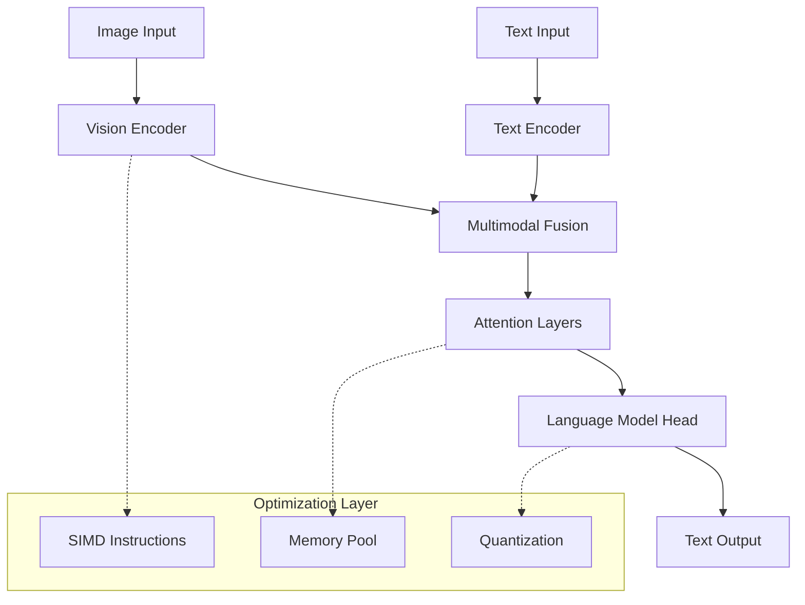

# Architecture Overview

## System Architecture

Tiny-VLM-Rust-WASM implements a lightweight Vision-Language Model optimized for mobile deployment through WebAssembly compilation and SIMD optimization.

### High-Level Architecture



## Core Components

### 1. Vision Tower
- **Purpose**: Extract visual features from 224x224 RGB images
- **Implementation**: SIMD-optimized convolution layers
- **Output**: Dense feature vectors for multimodal fusion

### 2. Text Encoder
- **Purpose**: Tokenize and embed text prompts
- **Implementation**: Lightweight transformer-based encoder
- **Vocabulary**: Optimized BPE tokenizer

### 3. Multimodal Fusion
- **Purpose**: Combine vision and text features
- **Architecture**: Cross-attention mechanism
- **Memory Layout**: Cache-friendly NHWC format

### 4. Language Model Head
- **Purpose**: Generate text responses
- **Implementation**: Autoregressive decoder
- **Optimization**: INT8 quantization for mobile

## Data Flow

```
Input Image (224×224×3) → Vision Processing → Feature Extraction
                                                    ↓
Text Prompt → Tokenization → Text Embedding → Multimodal Fusion
                                                    ↓
                           Attention Computation → Language Generation
                                                    ↓
                                            Token Decoding → Response
```

## Platform-Specific Optimizations

### WebAssembly Target
- **SIMD**: WebAssembly SIMD for vectorized operations
- **Memory**: Linear memory model with explicit management
- **Threading**: SharedArrayBuffer for parallel processing

### Mobile Native
- **ARM NEON**: Hand-tuned SIMD kernels
- **Neural Engine**: Core ML integration for iOS
- **Memory Pool**: Allocation reuse to minimize GC pressure

## Performance Characteristics

### Latency Targets
- **Mobile Safari**: < 200ms end-to-end
- **iOS Neural Engine**: < 150ms with hardware acceleration
- **Android WebView**: < 250ms with fallback

### Memory Footprint
- **WASM Binary**: < 5MB compressed
- **Runtime Memory**: < 100MB peak
- **Model Weights**: 15-50MB depending on quantization

## Security Considerations

### Memory Safety
- Rust's ownership model prevents buffer overflows
- WASM sandboxing isolates execution environment
- No unsafe code in public API surface

### Input Validation
- Image size constraints enforced at API boundary
- Text length limits prevent resource exhaustion
- Sanitized error messages prevent information leakage

## Scalability

### Horizontal Scaling
- Stateless inference enables request distribution
- Dynamic batching for throughput optimization
- Progressive loading for large model variants

### Vertical Scaling
- CPU core utilization through SIMD parallelism
- GPU acceleration via WebGL shaders (future)
- Memory efficiency through quantization techniques